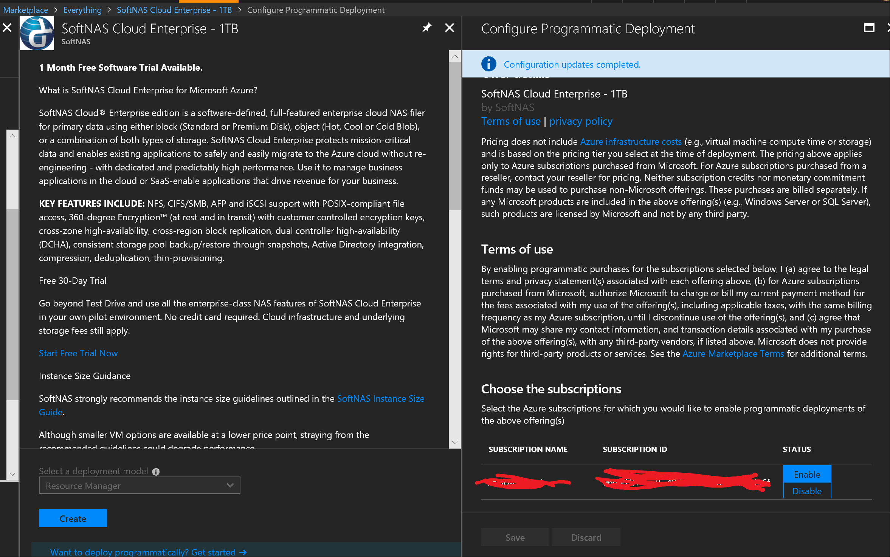

# SoftNAS configuration

In order to automate the SoftNAS appliance deployment the following steps are needed:

- on the Azure Portal do a manual creation of the SoftNAS offering
- before starting creating the resource, select *Want to deploy programmatically? Get started*
- then enable the current subscription by selecting *Enabled*
- finish preparing the installation and get the generated template and parameters files
- adapt the *softnasNode.json* template to the resulting information in the template

The *SoftnasNode.json* template can be called with the two different parameter files, in order to create the 2 nodes on the same availability set
The *configureSoftnasNode.sh* script can be customized to perform custom actions after startup

